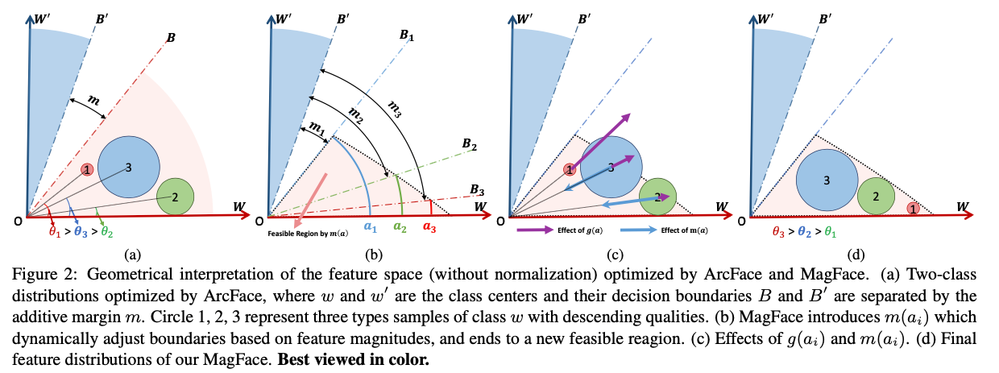

# MagFace
MagFace: A Universal Representation for Face Recognition and Quality Assessment  
in *IEEE Conference on Computer Vision and Pattern Recognition (CVPR)*, 2021, **Oral** presentation.



**Paper**: [arXiv](https://arxiv.org/abs/2103.06627)

**A toy example**: [examples.ipynb](inference/examples.ipynb)

**Poster**: [GoogleDrive](https://drive.google.com/file/d/1S0hoQNDJC_H8b8ryuYyF7xjVLMorlBu1/view?usp=sharing), [BaiduDrive](https://pan.baidu.com/s/1Ji1fRtwfTzwm9egWGtarWQ) code: dt9e

**Beamer**: [GoogleDrive](https://drive.google.com/file/d/1MPj_ghD7c1igA_fe20ooMbOcD-OsK0jC/view?usp=sharing), [BaiduDrive](https://pan.baidu.com/s/1wt9eqCbn6forcoAz1ZVrAw), code: c16b

**Presentation**: TBD

**NOTE**: The original codes are implemented on a private codebase and will not be released. 
**This repo is an official but abridged version.** See todo list for plans.

## BibTex

```
@inproceedings{meng2021magface,
  title={MagFace: A universal representation for face recognition and quality assessment},
  author={Meng, Qiang and Zhao, Shichao and Huang, Zhida and Zhou, Feng},
  booktitle=IEEE Conference on Computer Vision and Pattern Recognition,
  year=2021
}
```

## Model Zoo

| Parallel Method | Float Type | Backbone | Dataset | Split FC? | Model | Log File |
| --- | --- | --- | --- | --- | --- | --- |
| DDP | fp32 | iResNet100 | MS1MV2 | yes | [GoogleDrive](https://drive.google.com/file/d/1Bd87admxOZvbIOAyTkGEntsEz3fyMt7H/view?usp=sharing), [BaiduDrive](https://pan.baidu.com/s/15iKz3wv6UhKmPGR6ltK4AA) code: wsw3 |
| DP | fp32 | iResNet50 | MS1MV2 | No | [BaiduDrive](https://pan.baidu.com/s/1atuZZDkcCX3Bl14J8Ss_YQ) code: tvyv | [BaiduDrive](https://pan.baidu.com/s/1T6_TkEh9v9Vtf4Sw-chT2w), code: hpbt |

## Basic Training
1. install [requirements](raw/requirements.txt).
2. Prepare a training list with format `imgname 0 id 0` in each line, as indicated [here](dataloader/dataloader.py#L31-L32).
3. Modify parameters in run/run.sh and run it!

## Parallel Training
**Note:** Use **Pytorch > 1.7** for this feature. Codes are mainly based on Aibee's mpu (author: [Kaiyu Yue](http://kaiyuyue.com/), will be released in middle of April).

How to run: 

1. Update NCCL info (can be found with the command `ifconfig`) and port info in [train_dist.py](run/train_dist.py#L290-292)
2. Set the number of gpus in [here](run/train_dist.py#L283). 
3. If training with multi-machines, modify [node number](run/train_dist.py#L284) (not tested yet).
4. Enble fp16 training by setiing `--fp16 1` in run/run_dist.sh.
5. run run/run_dist.sh.


Parallel training (Sec. 5.1 in [ArcFace](https://arxiv.org/pdf/1801.07698v3.pdf)) can highly speed up training as well as reduce consumption of GPU memory. Here are some results.

| Parallel Method | Float Type | Backbone | GPU | Batch Size | FC Size | Split FC? | Avg. Throughput (images/sec) | Memory (MiB) | 
| --- | --- | --- | --- | --- | --- | --- | --- | --- |
| DP | FP32 | iResNet50 | v100 x 8 | 512 |  85742 | No | 1099.41 | 8681 |
| DDP | FP32 | iResNet50 | v100 x 8 | 512 |  85742 | **Yes** | 1687.71 | 8137 |
| DDP | FP16 | iResNet50 | v100 x 8 | 512 |  85742 | **Yes** | 3388.66 | 5629 |
| DP | FP32 | iResNet100 | v100 x 8 | 512 |  85742 | No | 612.40 | 11825 |
| DDP | FP32 | iResNet100 | v100 x 8 | 512 |  85742 | **Yes** | 1060.16 | 10777 |
| DDP | FP16 | iResNet100 | v100 x 8 | 512 |  85742 | **Yes** | 2013.90 | 7319 |

## Logs
TODO list:

- [x] add toy examples and release models
- [x] migrate basic codes from the private codebase 
- [x] add beamer (after the ddl for iccv2021)
- [x] test the basic codes 
- [ ] add presentation
- [x] migrate parallel training 
- [ ] release mpu (Kaiyu Yue, in April)
- [ ] test parallel training 
- [ ] add evaluation codes for recognition
- [ ] add evaluation codes for quality assessment
- [x] add fp16
- [ ] test fp16
- [ ] extend the idea to CosFace

**20210325.2** Add codes for parallel training as well as fp16 training (not tested).

**20210325** The basic training codes are tested! Please find the trained model and logs from the table in Model Zoo.

**20210323** add requirements and beamer presentation; add debug logs.

**20210315** fix figure 2 and add gdrive link for checkpoint.

**20210312** add the basic code (not tested yet).

**20210312** add paper/poster/model and a toy example.

**20210301** add ReadMe and license.
